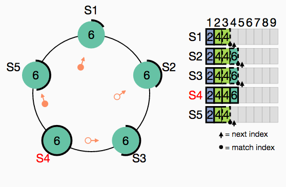

# Model of Raft for Runway

[try this model in Runway](https://runway.systems/?model=github.com/ongardie/runway-model-raft)

This is a model of [Raft](https://raft.github.io) for
[Runway](https://github.com/salesforce/runway-browser). It includes a
`.model` file describing the state and how it changes, as well as a `.js` file
which can be used with
[runway-browser](https://github.com/salesforce/runway-browser) to produce an
interactive visualization.

The model you find in this repo is an early draft and may not be correct. This
is certainly not the official specification of Raft; if there is such a thing,
it's [raft.tla](https://github.com/ongardie/raft.tla).

The view is very similar to [RaftScope](https://raft.github.io/raftscope)
([code](https://github.com/ongardie/raftscope)). This model is on its way to
become RaftScope v2.0, but RaftScope is still easier to embed and has the
[replay mode](https://raft.github.io/raftscope-replay) that's useful for talks.
